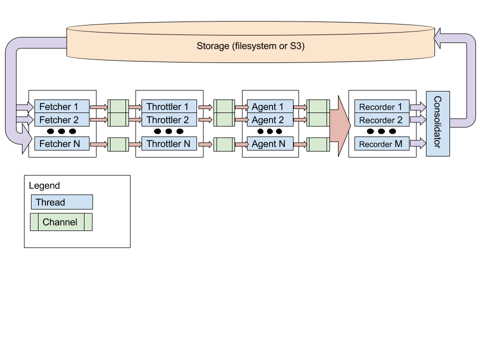

# requestinator

A Clojure library designed to generate and execute requests against a
web service based on a [Swagger](http://swagger.io) specification.

## Build a Docker Image

Docker image names are based on the git revision. The following
sequence of commands will build a docker image named
`requestinator:v1.2.3`. It will also tag it `latest`.

```
git commit -am "Message for commit"
git tag v1.2.3
bin/build
```

## Generating Requests

### Run Via Leinginen Against the Local Filesystem

Generate three indepdendent, random sequences of requests based on the
[Petstore Sample Service](http://petstore.swagger.io/), and save it to
`/tmp/requestinator-test`. Requests will be scheduled on average
twice a second for each of the three agents, and 60 seconds worth of
data will be generated.

```
lein run generate --spec-uri http://petstore.swagger.io/v2/swagger.json --destination file:///tmp/requestinator-test --agent-count 3 --interarrival-sec 0.5 --duration-sec 60
```

### Run Via Docker Against S3

```
docker run -e AWS_ACCESS_KEY_ID -e AWS_SECRET_KEY requestinator generate --spec-uri http://petstore.swagger.io/v2/swagger.json --destination s3://com.cognitect.requestinator.test/readme-example --agent-count 3 --interarrival-sec 0.5 --duration-sec 60
```

This example assumes you have `AWS_ACCESS_KEY` and `AWS_SECRET_KEY` environment variables set to provide access to the `com.cognitect.requestinator.test` bucket.

## Executing Requests

### Run Via Leingen Against the Local Filesystem

```
lein run execute --source file:///tmp/requestinator-test --destination file:///tmp/requestinator-test/results --recorder-concurrency 3
```

### Run Via Docker Against S3

```
docker run -e AWS_ACCESS_KEY_ID -e AWS_SECRET_KEY requestinator execute --source s3://com.cognitect.requestinator.test/readme-example --destination s3://com.cognitect.requestinator.test/readme-example/results --recorder-concurrency 3
```

## Generating Reports

### Run Via Leingen Against the Local Filesystem

```
TODO
```

## Architecture

### Execution



## TODO

- Implement the rest of Swagger. Pretty good coverage at the moment,
  but definitely some of the spec is not implemented. Partial list:
  - [ ] Support for `required` being false
  - [ ] Support for XML
  - [ ] Overriding consumes
- Implement the rest of [JSON Pointer](http://tools.ietf.org/html/rfc6901).
- Improve tests

## License

Copyright © 2016 Cognitect, Inc.

